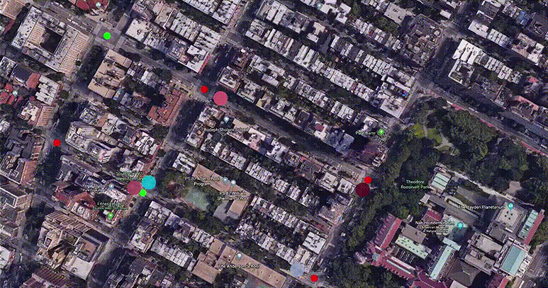
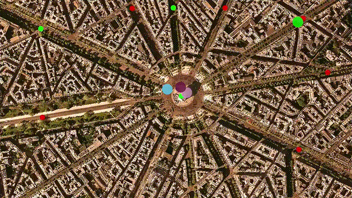

# Concurrent Traffic Simulation
Multithreaded traffic simulator on real urban map using real-time computer vision library OpenCV. Run each vehicle on a
separate thread, and manage intersections to facilitate traffic flow and avoid collisions. This concurrent traffic simulation creates separate threads for each vehicle, intersection, and traffic light object with each thread performing a specialised task in parallel to the main program execution.

<p align="center"> <em>New York City traffic simulation</em> </p>
<p>  </p>

<p align="center"> <em>Paris Arc De Triomphe traffic simulation</em> </p>
<p>  </p>


## Cloning
You can clone the repository with HTTPS:
```
https://github.com/ShivamGoel05/concurrent-traffic-simulation.git
```
or with SSH:
```
git@github.com:ShivamGoel05/concurrent-traffic-simulation.git
```

## Dependencies
* cmake >= 3.11
  * All OSes: [click here for installation instructions](https://cmake.org/install/)
* make >= 4.1 (Linux, Mac), 3.81 (Windows)
  * Linux: make is installed by default on most Linux distros
  * Mac: [install Xcode command line tools to get make](https://developer.apple.com/xcode/features/)
  * Windows: [Click here for installation instructions](http://gnuwin32.sourceforge.net/packages/make.htm)
* gcc/g++ >= 5.4
  * Linux: gcc / g++ is installed by default on most Linux distros
  * Mac: same deal as make - [install Xcode command line tools](https://developer.apple.com/xcode/features/)
  * Windows: recommend using [MinGW](http://www.mingw.org/)
* OpenCV >= 4.1
  * Linux: `sudo apt-get install opencv`
  * Mac: `brew install opencv`
  * The OpenCV 4.1.0 source code can be found [here](https://github.com/opencv/opencv/tree/4.1.0)
  
## Compiling and Running
### Compiling
To compile the project, create a `build` directory and change to that directory:
```
mkdir build && cd build
```
From within the `build` directory, run `cmake` and `make` as follows:
```
cmake ..
make
```

### Running
The executable will be placed in the `build` directory. From within `build`, you can run the project as follows:
```
./traffic_simulation
```
  
